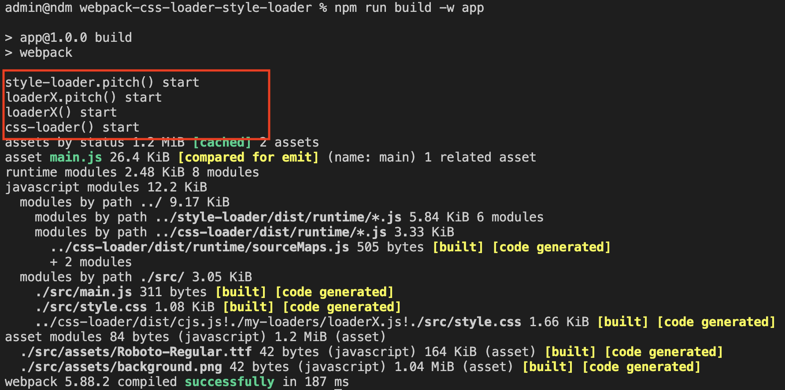

# Webpack and Loader

A monorepo setup with the source code of style-loader and css-loader for experiment on how chained loaders works.

```
npm install
npm run build -w css-loader -w style-loader
npm run build -w app
```

Result:


